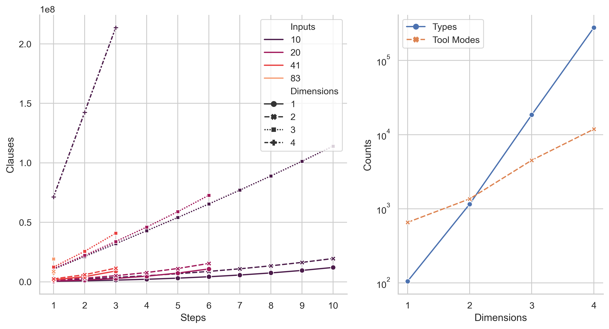
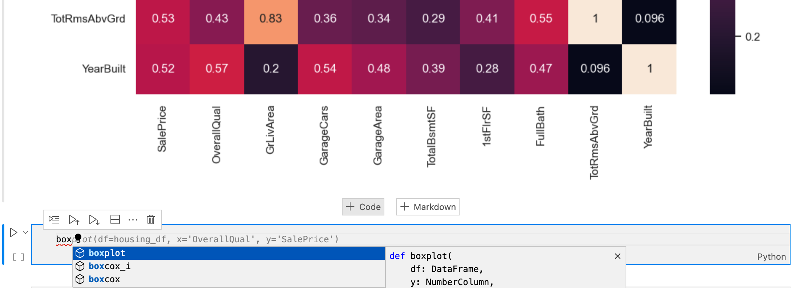

# Master Thesis. APE in Data Science
Data Science Ontology, ASP Variant, Experiment Scripts, and Results.

This repository contains files from the master thesis "Automated Construction of Data Science Workflows" presented at the University of Potsdam chair for software engineering in 2023. It aims at exploring the applicability of the Automated Pipeline Explorer (APE) to general purpose workflows in the data science field. To this end, the thesis

0. limits the scope of potential workflows,
1. models the data science domain ontology,
2. evaluates its performance with native APE,
3. implements a solutions-to-executable-notebook parser,
4. implements an alternative APE solver based on Answer Set Programming (ASP),
5. evaluates the performance of native APE and APE with the ASP solver, and
6. experiments with generative AI in workflow construction.

> **Note**: This repository is primarily intended to serve as an archival record of the research and experiments conducted in this thesis project. While both the experiment outputs and their producing scripts are contained, please note that additional configuration may be necessary to adapt it to your specific environment. This could include file paths, library versions, and other dependencies (APE-2.0.3-executable.jar, APE sample use cases).

## Thesis

- PDF: [`Automated_Construction_of_Data_Science_Workflows.pdf`](Automated_Construction_of_Data_Science_Workflows.pdf)
- Source: [`Tex/`](Tex)

## Toolset & Ontology

### Toolset

Python library: [`wrapper_functions.py`](wrapper_functions.py)

### Ontology

#### Used Version

- OWL: [`ontology/ontology_v2_DIM_2.owl`](ontology/ontology_v2_DIM_2.owl)
- Tool annotations: [`ontology/tool_annotations_v2_DIM_2.json`](ontology/tool_annotations_v2_DIM_2.json)

#### Other Variants

[`ontology/variants/`](ontology/variants)

- OWL and tool annotations for different numbers of dimensions (1, 3, 5)
- V1 OWL

#### Source

- Raw markdown ontology: [`ontology/src/markdown/`](ontology/src/markdown)
    - DataClass dimension: `data_class_...md`
    - DataSetIndex dimension: `data_set_index_...md`
    - DataState dimension: `data_state_...md`
    - StatisticalRelevance dimension: `statistical_relevance_...md`
    - Tool dimension with annotations: `tools_...md`
- Scripts to generate OWL and tool annotations
    - Markdown parser module: [`ontology/src/scripts/md_to_json.py`](ontology/src/scripts/md_to_json.py)
    - Generates ontologies with different numbers of dimensions: [`ontology/src/scripts/multi_ontology.ipynb`](ontology/src/scripts/multi_ontology.ipynb)

## Native APE Output Parsing

Module: [`native_ape_output_parsing/APE_to_notebook.py`](native_ape_output_parsing/APE_to_notebook.py)

## ASP APE Solver

Modules:
- APE input to ASP instance: [`asp_backend/ape_to_asp/`](asp_backend/ape_to_asp)
    - Reads OWL, tool annotations, constraints, and config
    - Creates ASP instance from internal representation
- ASP problem encoding: [`asp_backend/asp_encoding/`](asp_backend/asp_encoding)
    - Encodings for auxiliary predicates (`aux.lp`) and goal conditions (`goal.lp`)
    - Encodings of APE's constraints (`constraints.lp`)
    - Encodings for output filtering  (`io.lp`)
    - All other encodings and predicates are named after their SAT counterpart from APE
- Incremental solver: [`asp_backend/asp_solver/`](asp_backend/asp_solver)
- Output parsing: [`asp_backend/workflow_output`](asp_backend/workflow_output)
    - Parses ASP output to workflow representation
    - Creates notebook from workflow representation (adapted from [`native_ape_output_parsing/APE_to_notebook.py`](native_ape_output_parsing/APE_to_notebook.py))
- Some tests: [`asp_backend/tests`](asp_backend/tests)

## Experiments

### Native APE Performance

- Evaluates native APE performance on the data science ontology
- Uses different numbers of dimensions (1, 2, 3, 4)
- Uses different numbers of inputs (10, 20, 41, 83) ~ (1/8, 1/4, 1/2, 1) of the total number of housing data columns

#### Source Code
path: [`experiments/native_ape/complexity/src/`](experiments/native_ape/complexity/src/)

- Config variants: `config_DIM_?_COLS_?.json`
- Experiment script: `collect_stats.ipynb`
- Output parsing script: `parse_stats.ipynb`

#### Results

- Experiment logs: `*.log`
- Visualized experiment statistics: `*.png`

### Native APE, Data Science Ontology, Use Case Evaluation

Evaluation of native APE on the data science ontology with the three use cases:

- House price EDA: [`experiments/native_ape/house_prices/`](experiments/native_ape/house_prices/)
- Titianic predictive modeling: [`experiments/native_ape/titanic/`](experiments/native_ape/titanic/)
- IMDB Text analyis: [`experiments/native_ape/imdb/`](experiments/native_ape/imdb)

File to run the experiments:
- EDA: [`experiments/native_ape/run_ape_housing.ipynb`](experiments/native_ape/run_ape_housing.ipynb)
- Predictive modeling: [`experiments/native_ape/run_ape_titanic.ipynb`](experiments/native_ape/run_ape_titanic.ipynb)
- Text analysis: [`experiments/native_ape/run_ape_imdb.ipynb`](experiments/native_ape/run_ape_imdb.ipynb)

All use case folder have the same structure:
- `out/`: Outputs
    - `iteration_?`: Constraint set experiment folder
        - `Figures/`: Workflow graphs produced by APE
        - `images/`: Experiment artifacts if any
        - `config_run.json`: APE config
        - `constraints_run.json`: APE constraints
        - `solutions.txt`: APE solutions file
        - `workflow_?_start_?.ipynb`: Workflow notebooks
- `src/`: Source code`
    - `train.csv`: Input data
    - `wrapper.ipynb`: Input data to APE input config

### ASP APE Solver, Data Science Ontology, Use Case Evaluation

Evaluation of the ASP APE solver on the data science ontology.

- [`experiments/asp/domain_heuristics.lp`](experiments/asp/domain_heuristics.lp): Contains some domain heuristics used in the experiments.
- `run_ape_?.py`: Experiment CLI scripts
- `run_ape_?.log`: Experiment logs
- Output folders
    - `iteration_?`: Constraint set experiment folder
        - `asp/`: ASP instance encodings
        - `solutions/`: Workflow notebooks
        - `config_run.json`: APE config
        - `constraints_run.json`: APE constraints

### Some Generative AI Experiments

### ChatGPT

Chat export: [`experiments/chatgpt_bard_copilot/chat_gpt_chats.html`](experiments/chatgpt_bard_copilot/chat_gpt_chats.html)

- Housing prices
- Indian housing prices
- Indian housing prices renamed
- IMDB
- Employee churn

### Bard

Bard export: [`experiments/chatgpt_bard_copilot/bard_chat.pdf`](experiments/chatgpt_bard_copilot/bard_chat.pdf)

- Data Access
- Workflow Construction
- Python Script Execution

### Copilot

Screenshots of Copilot suggestions

**Suggestion after previously plotting**

**Suggestion after previously checking normality**

