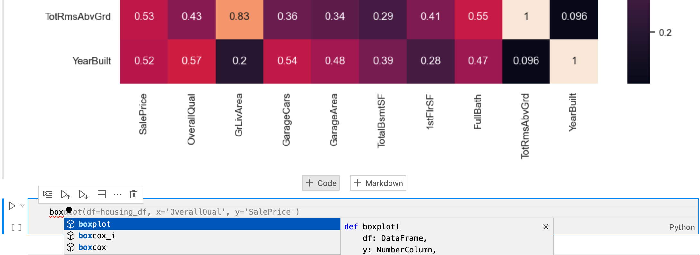

# Experiments

## Native APE Performance

- Evaluates native APE performance on the data science ontology
- Uses different numbers of dimensions (1, 2, 3, 4)
- Uses different numbers of inputs (10, 20, 41, 83) ~ (1/8, 1/4, 1/2, 1) of the total number of housing data columns

### Source Code
path: [`native_ape/complexity/src/`](native_ape/complexity/src/)

- Config variants: `config_DIM_?_COLS_?.json`
- Experiment script: `collect_stats.ipynb`
- Output parsing script: `parse_stats.ipynb`

### Results

- Experiment logs: `*.log`
- Visualized experiment statistics: `*.png`

## Native APE, Data Science Ontology, Use Case Evaluation

Evaluation of native APE on the data science ontology with the three use cases:

- House price EDA: [`native_ape/house_prices/`](native_ape/house_prices/)
- Titanic predictive modeling: [`native_ape/titanic/`](native_ape/titanic/)
- IMDB Text analysis: [`native_ape/imdb/`](native_ape/imdb)

File to run the experiments:
- EDA: [`native_ape/run_ape_housing.ipynb`](native_ape/run_ape_housing.ipynb)
- Predictive modeling: [`native_ape/run_ape_titanic.ipynb`](native_ape/run_ape_titanic.ipynb)
- Text analysis: [`native_ape/run_ape_imdb.ipynb`](native_ape/run_ape_imdb.ipynb)

All use case folders have the same structure:
- `out/`: Outputs
    - `iteration_?`: Constraint set experiment folder
        - `Figures/`: Workflow graphs produced by APE
        - `images/`: Experiment artifacts, if any
        - `config_run.json`: APE config
        - `constraints_run.json`: APE constraints
        - `solutions.txt`: APE solutions file
        - `workflow_?_start_?.ipynb`: Workflow notebooks
- `src/`: Source code
    - `train.csv`: Input data
    - `wrapper.ipynb`: Input data to APE input config

## ASP APE Solver, Data Science Ontology, Use Case Evaluation

Evaluation of the ASP APE solver on the data science ontology.

- [`asp/domain_heuristics.lp`](asp/domain_heuristics.lp): Contains some domain heuristics used in the experiments.
- `run_ape_?.py`: Experiment CLI scripts
- `run_ape_?.log`: Experiment logs
- Output folders
    - `iteration_?`: Constraint set experiment folder
        - `asp/`: ASP instance encodings
        - `solutions/`: Workflow notebooks
        - `config_run.json`: APE config
        - `constraints_run.json`: APE constraints

## Some Generative AI Experiments

## ChatGPT

Chat export: [`chatgpt_bard_copilot/chat_gpt_chats.html`](chatgpt_bard_copilot/chat_gpt_chats.html)

- Housing prices
- Indian housing prices
- Indian housing prices renamed
- IMDB
- Employee churn

## Bard

Bard export: [`chatgpt_bard_copilot/bard_chat.pdf`](chatgpt_bard_copilot/bard_chat.pdf)

- Data Access
- Workflow Construction
- Python Script Execution

## Copilot

Screenshots of Copilot suggestions

**Suggestion after previously plotting**

**Suggestion after previously checking normality**

